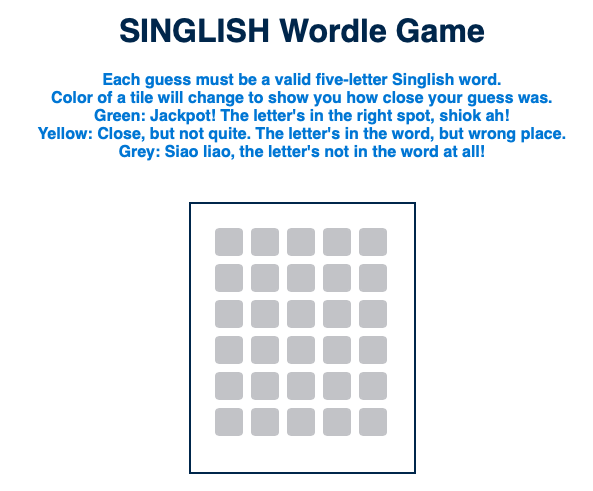

## Screenshot/Logo 

## Game Name
Singlish Wordle

## Link to game
https://dynamic-axolotl-7344c7.netlify.app

## user stories

As a user, I want to start a new game so that I can play Wordle from the beginning.
As a user, I want to input a word so that I can try to guess the word.
As a user, I want to see feedback on my guess so that I know which letters are correct and in the correct position, which are correct but in the wrong position, and which are incorrect.
As a user, I want to see the number of remaining attempts so that I know how many guesses I have left.
As a user, I want to see a message when I win or lose so that I know the outcome of the game.
As a user, I want to reset the game so that I can play again without refreshing the page.

## high level MVC scope + ## pseudoCode

**Model:**
store the target word
store the current state of game 

**View:**
Display the current state of the game to user
provide input fields

**Controller:**
handle user input
update model based on user input
Update the view based on the changes in the model

## wireframe:

use figma (done) for CSS && wireframe

1. Define any variables used to track the state of the game:

   ## state variables

   let targetWord; //the word the player is trying to guess from a constant list
   let currentWord;  
    let board[]; //an array to store all the guesses
   let maxAttempt; //max guesses allowed
   let gameStatus(in this case its winner a boolean function); //win status, currently playing status and lost status --> when reached the limit of 6 tries

2. Define the required constants:

   ## constant variables

   const listOfWords (targetWord) //array of 5 letter words []

3. Handle a player clicking a button
   when player starts off by entering 5 letters and clicks enter button
   guess is stored into array called guesses

4. Handle handleEnterPress 
      Loop through the words: Compare each character in currentWord with targetWord.  (done)
      Check for exact matches: If characters match and are in the same position, mark them (e.g., change the div color to green). (done)
      Check for partial matches: If characters match but are in different positions, mark them differently (e.g., change the div color to yellow). (done)
      Update the board: Use your render function to update the board with the new colors. (done)
      when enter keydown is activated, row 1 is locked and player focuses on row 2, game repeats 

5. Compare the player choice to the computer choice, and check for a winner
   gameStatus is updated if maxAttempt is not met

6. Render a win/lose/tie message to the player
   gamneStatus will show either win lose (if max Attempt is hit and currentGuess !== targetWord)

## Attributions

tabindex from Google focusable element on HTML so user can start game and insert currentWord
https://developer.mozilla.org/en-US/docs/Web/HTML/Global_attributes/tabindex + https://tetralogical.com/blog/2024/04/04/when-to-use-tabindex-0/ 

randomize targetWord
//https://developer.mozilla.org/en-US/docs/Web/JavaScript/Reference/Global_Objects/Math/random 

enter keydown and single inputs as an event.key + regular expression restrictions backend --> reconize only lowercase for user simplicity
//https://stackoverflow.com/questions/38955573/how-to-check-keyboardevent-key-in-specific-range-in-javascript + https://stackoverflow.com/questions/12745930/javascript-regex-uppercase-and-lowercase-and-mixed

comparing and checking if elements are equal (targetWord and currentWord) and if so push index to the array and use that array to execute the color code (either green or yellow)
https://stackoverflow.com/questions/70040227/how-do-you-check-two-strings-in-js-and-determine-if-any-letters-in-each-is-place

tech used: JavaScript, HTML and CSS

Next steps: 
1) user cannot re enter incorrect guess
2) user cannot enter a non dictionary word - read up online that a list of dictionary words can be loaded onto a .txt file but i have not tried it
3) create a form and allow user to choose difficulty level e.g. length of words + number of guesses --> game will that that input and change accordinly so const wordLength = 5; and const maxAttempt = 6; will be varaibles instread of constants
4) explore how to make my code more efficient..
   console.time and console.timeEnd 
   time complexity Big O notation --> from AI it states thst my code is const getSameLetters () has a big O of ( O(n^2) ) and the runtime of my function will grow quadratically as targetWord increases.